POC broker and consumer queue processor.  This repo also has a modified PostgresOrderedMessageQueue, which supports streaming consumer queues by "correllation_key" whilst still maintaining the stream id in the original message.  I also added attempt counting so resiliency features can be added in the future.  A DLQ can be attained by setting LOCKED_BY to "DLQ" with a date very far into the future if attempt count is over a certain threshold.

# Limitation
* Consumer queue polls on an interval but LISTEN/NOTIFY should be implemented to improve message processing latency.

# To run
- Edit postgres config at top of [./src/index.ts](https://github.com/TomKaltz/ConsumerQueueExp/blob/main/src/index.ts)
- ```npm install```
- Run ```npm run dev```

Messages from different correllation_keys are processed in an interleaved manner across all "slots" within an individual processor(conconrurency > 1) and/or across multiple machines).  This is the "processing pool".

```mermaid
gantt
    title Slot-Based View: Processing Timeline
    dateFormat x
    axisFormat %L ms
    
    section Processor1
    E2 S2    :crit, 0, 30
    E6 S1    :done, 30, 40
    E7 S3    :active, 40, 50
    E9 S1    :done, 50, 80
    
    section Processor2
    E4 S3    :active, 0, 40
    E8 S2    :crit, 40, 70
```

